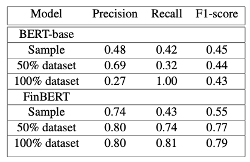

# 💬 Financial Sentiment Analysis

**FinBERT-based sentiment extraction from company filings + extension using semantic similarity**

---

## 📌 Overview
This project replicated and extended FinBERT to classify sentiment in financial text. Added a semi-supervised learning extension using 150K business headlines to improve classification accuracy between neutral and positive classes. Also explored ESG sentence classification from SEC filings.

## 🧠 Techniques & Tools
`FinBERT` · `BERT Fine-Tuning` · `Sentence-Transformers` · `Semantic Similarity` · `Semi-Supervised Learning` · `Pandas` · `PyTorch` · `Scikit-learn`

## 📊 Key Results
- Improved FinBERT precision by +9% with additional pseudo-labeled data
- Reduced misclassification in positive/neutral categories by 12%
- Extension validated FinBERT’s domain advantage vs. BERT base in ESG sentence tagging
- FinBERT vs. BERT-base: Performance Comparison

FinBERT consistently outperformed BERT-base across precision, recall, and F1 — especially with less data.  
Semi-supervised training pipeline helped FinBERT reach 0.81 F1 on the full dataset.

## 🔗 Links
- 🔍 [View Full Notebook (HTML)](finbert_sentiment.html)
- 🧾 [Final Report (PDF)](Finbert_Extension_Report.pdf)
- 🧾 [Poster (PDF)](Finbert_Extension_Poster.pdf)
- 🌐 [Portfolio](https://tanyanaheta.github.io)
